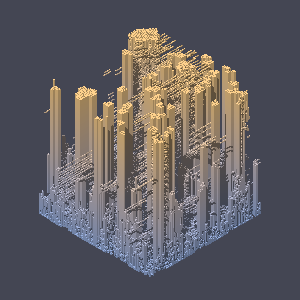
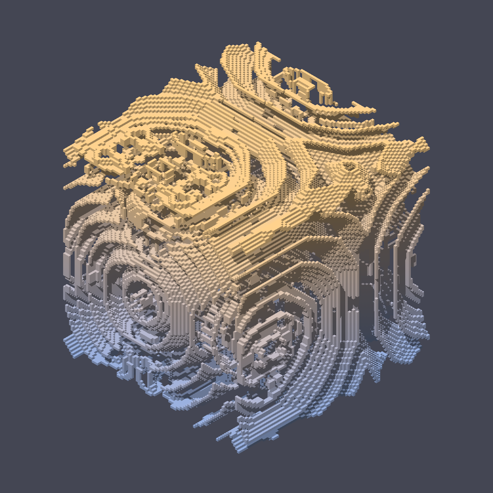
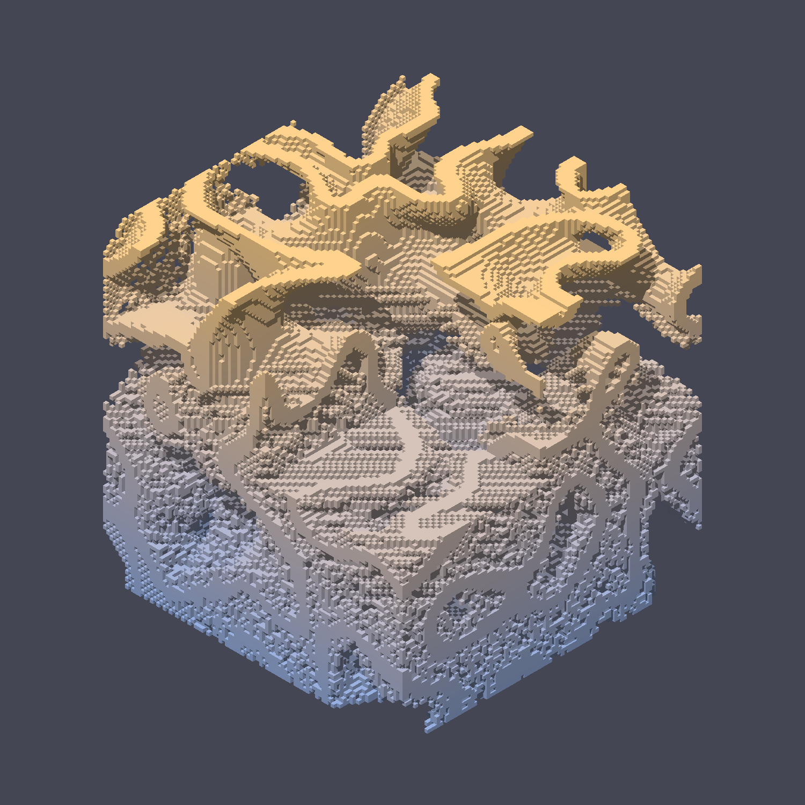

This is my space to task LLM's with doing analysis and renders of 3D cellular automata,
  while I build a proper app elsewhere for humans to toy with the most promising results.

The real project [is in the "new" folder](new/README.md), including a through readme.
Old garbage is in the "raws" folder and can be safely ignored.

## Why?

This all started as a chat with a Claude bot trying to understand existing Cellular Automata.
On a whim, I asked it to make 3D renders (using DDA, no GPU necessary) of weirder and weirder setups.
Eventually I hit on a really awesome scene! And I tasked it with various experiments to understand what was made.

After a while, the chat context was far too long to be usable and still Claude wasn't compacting it.
So I extracted all the useful bits into this repo's "raw" folder, and converted it into a proper Python codebase
  which you can now find in this repo's "new" folder.

That ugly, minimized pile of analysis+render scripts are now a tool for exploring 3D cellular automata!
That really good scene I found is called the "cityscape", and you can find it in here.